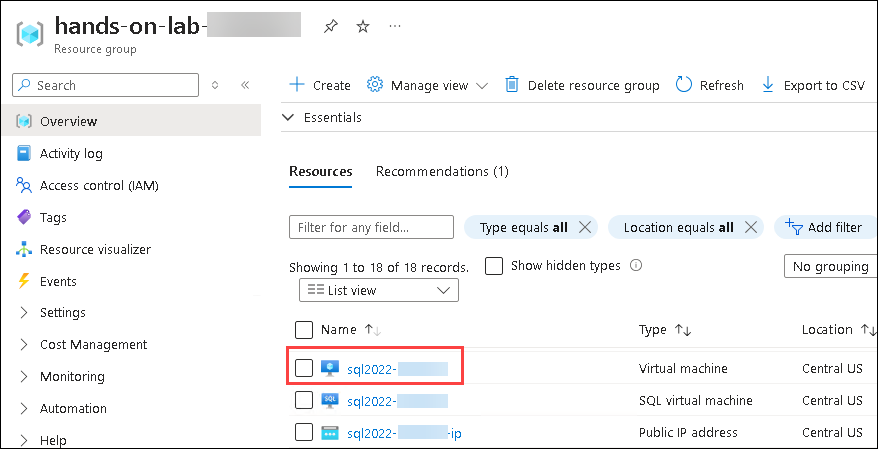
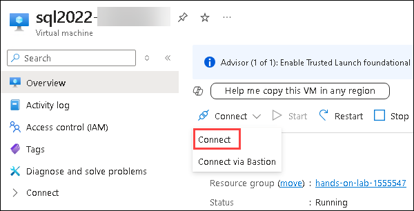
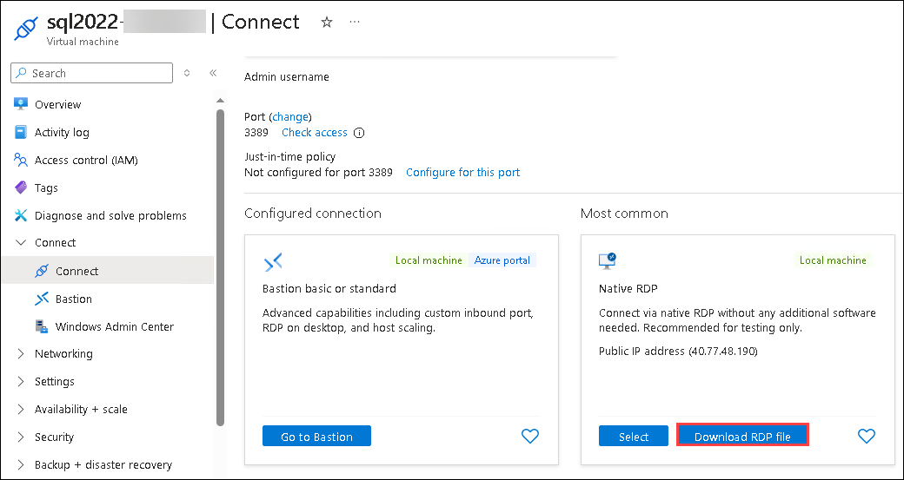
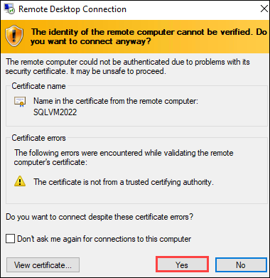
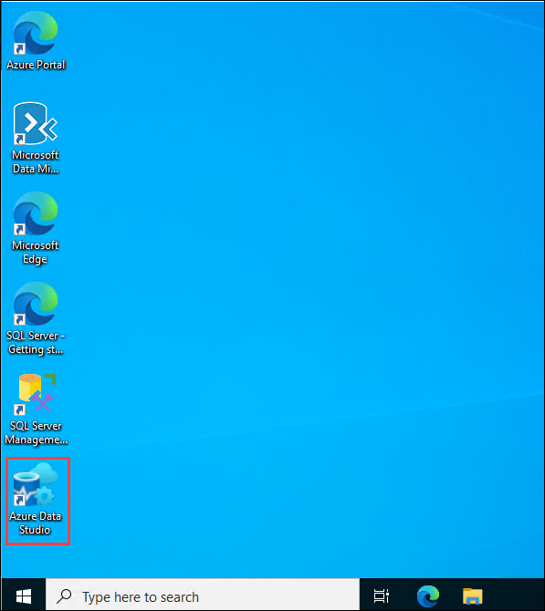
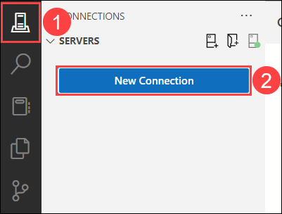
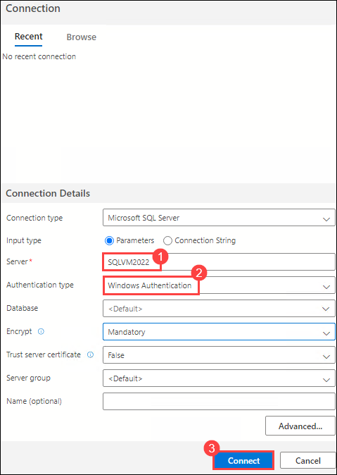
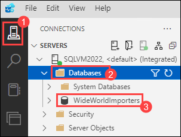
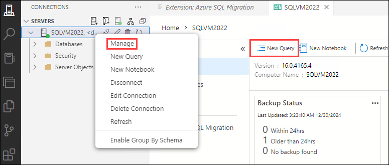

# Exercise 2: Perform database assessments

### Estimated Duration: 30 minutes

## Overview 

In this lab, you will connect to the WideWorldImporters database on the SqlServer2022 VM and perform assessments for migration to Azure SQL Database and Azure SQL Managed Instance. These assessments will help you understand the compatibility and readiness of your database for migration to Azure. You will evaluate the database schema, data, and performance to identify any potential issues and determine the best migration strategy. This process ensures a smooth transition to Azure’s cloud services, leveraging their scalability, security, and advanced features.

## Lab Objective

In this lab, you will perform the following:

- Task 1: Connect to the WideWorldImporters database on the SqlServer2022 VM
- Task 2: Perform assessment for migration to Azure SQL Database
- Task 3: Perform assessment for migration to Azure SQL Managed Instance

### Task 1: Connect to the WideWorldImporters database on the SqlServer2022 VM

1. On Azure Portal page, in **Search resources, services and docs (G+/)** box at the top of the portal, enter **Resource groups**, and then select **Resource groups** under services.

   

1. Select the **<inject key="Resource Group Name" enableCopy="false"/>** resource group from the list.

   .png)

1. In the list of resources for your resource group, select the **sql2022-<inject key="Suffix" enableCopy="false"/>** Virtual Machine.

    

1. From the overview page of the **sql2022-<inject key="Suffix" enableCopy="false"/>** VM, select **Connect > Connect**.

    

1. On the **sql2022-<inject key="Suffix" enableCopy="false"/> | Connect** page, click on **Download RDP file (2)**. 
  
    

1. Click on **Keep**, on the Downloads pop-up. 

    

1. Click on **Open file**.

    

1. Next, on the RDP tab click on **Connect**.

   

1. Enter the following credentials when prompted, and then select **OK**:

   - **Username**: `sqlmiuser`
   - **Password**: `Password.1234567890`

      

1. Select **Yes** to connect if prompted that the remote computer's identity cannot be verified.

    

1. Click on **Azure Data Studio** from the Desktop.

    

   >**Note**: Within **Azure Data Studio**, if prompted with any pop-ups related to updates, kindly disregard them and proceed with tasks.
    
1. In the Azure Data Studio select **Extensions (1)** from the Activity Bar, enter **SQL Migration (2)** into the search bar, select **Azure SQL Migration (3)**, and click on **Install (4)**.  

    

1. In the Azure Data Studio select **Connections (1)** from the Activity Bar and click on **New Connection (2)**.
  
    

1. Enter **SQLVM2022(1)** into the Server name box, ensure **Windows Authentication (2)** is selected, and then click on **Connect (3)**.

     

     > **Note**: If you see **Connection error** pop-up click on **Enable Trust server certificate**.

      

1. Once connected, verify you see the **WideWorldImporters** database listed under databases.

    

1. Right click on **SQLVM2022**, click on **Manage**, and select **New Query** from the Azure Data Studio toolbar.

    

1. Next, copy and paste the SQL script below into the new query window. This script enables the Service broker and changes the database recovery model to FULL.

    ```sql
    USE master;
    GO

    -- Update the recovery model of the database to FULL and enable Service Broker
    ALTER DATABASE WideWorldImporters SET
    RECOVERY FULL,
    ENABLE_BROKER WITH ROLLBACK IMMEDIATE;
    GO
    ```

1. To run the script, select **Run** from the Azure Data Studio toolbar.

    

### Task 2: Perform assessment for migration to Azure SQL Database

In this task, you use the Microsoft Data Migration Assistant (DMA) to assess the `WideWorldImporters` database against the Azure SQL Database (Azure SQL DB). The assessment provides a report about any feature parity and compatibility issues between the on-premises database and the Azure SQL DB service.

1. In Azure Data Studio click on **SQLVM2022** > **Azure SQL migration (1)** and select **+ New migration (2)**.

    

2. In **Step 1: Database for assessment**, select **widewordimplantation**, click on **Next**. 

   

3. In **Step 2: Assessment summary and SKU recommendation (1)**, you will view the summary and SKU recommendations for your SQL server. Click on **Next (2)**. 

   

4. In **Step 3: Target Platform and Assessment Results**, Select **Azure SQL DataBase(1)** from the drop down. Then select **WideWorldImporters(2)** under the database, review the migration assessment to determine the possibility of migrating to Azure SQL DB, and Click on the **Cancel (3)** button.

   

5. Click on **Yes** when prompted to Cancel Migration.

    

### Task 3: Perform assessment for migration to Azure SQL Managed Instance

With one PaaS offering ruled out due to feature parity, perform a second DMA assessment against Azure SQL Managed Instance (SQL MI). The assessment provides a report about any feature parity and compatibility issues between the on-premises database and the SQL MI service.

1. In Azure Data Studio click on >  **SQLVM2022** > **Azure SQL migration (1)** and select **+ New migration (2)**.

    

2. In **Step 1: Database for assessment**, select **widewordimplantation**, click on **Next**. 

   

3. In **Step 2: Assessment summary and SKU recommendation (1)**, you will view the summary and SKU recommendations for your SQL server. Click on **Next (2)**. 

    

4. In **Step 3: Target Platform and Assessment Results**, Select **Azure SQL Managed Instance (1)** from the drop down. Then select **WideWorldImporters (2)** under the database, review the migration assessment to determine the possibility of migrating to Azure SQL DB, and Click on the **Cancel (3)** button.

     

   >**Note**: The database, including the Service Broker feature, can be migrated as is, providing an opportunity for WWI to have a fully managed PaaS database running in Azure. Previously, their only option for migrating a database using features incompatible with Azure SQL Database, such as Service Broker, was to deploy the database to a virtual machine running in Azure (IaaS) or modify the database and associated applications to remove the use of the unsupported features. The introduction of Azure SQL MI, however, provides the ability to migrate databases into a managed Azure SQL database service with _near 100% compatibility_, including the features that prevented them from using Azure SQL Database.

5. Click on **Yes** when prompted to Cancel Migration.

    

## Review 
In this lab, you have connected to the WideWorldImporters database on the SqlServer2022 VM, performed assessment for migration to Azure SQL Database and Azure SQL Managed Instance.

### You have successfully completed the lab!
